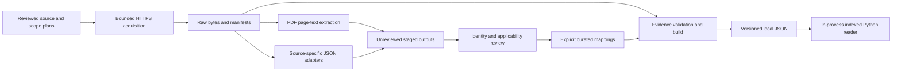

# Architecture Requirements and Design

## 1. Status and Boundaries

Version 0.1, 2026-09-22. Describes implemented local tooling and explicitly identifies proposed production requirements. Product scope and acceptance criteria: [PRD.md](PRD.md).

US Toyota acquisition resumed by user authorization, MY2015 onward including already-published 2027. Commands are operator actions, not scheduled jobs. EPA, Honda, IIHS and third-party archive holds remain. No originals are sent to an external model.

The existing inventory Search service and its JD Power integration remain outside this system. No VINs, individual inventory vehicles, new service endpoints, or OpenSearch deployment are required here.

## 2. Architecture



PDF review is a human workflow, not an implemented automatic table parser. General-reference knowledge does not yet have its own published runtime schema; those PDFs remain staged evidence. EPA menu discovery uses a distinct manifest shape and must not be mixed into detail/PDF raw runs.

## 3. Owning Modules

| Module | Responsibility |
| --- | --- |
| [vehicle_catalog/models.py](vehicle_catalog/models.py) | Strict typed source, artifact, evidence, candidate, configuration, fact, review and catalog contracts |
| [vehicle_catalog/pipeline.py](vehicle_catalog/pipeline.py) | Fetch, URL validation, hash integrity, write-once files, EPA/NCAP adapters, reviewed catalog build |
| [vehicle_catalog/documents.py](vehicle_catalog/documents.py) | Vehicle/reference PDF plans, download/extract runs, readable links, offline re-extraction |
| [vehicle_catalog/batch.py](vehicle_catalog/batch.py) | Bounded structured-data acquisition, make/model/year verification, candidate/run reports |
| [vehicle_catalog/discovery.py](vehicle_catalog/discovery.py) | EPA year/model menu snapshots and uncurated source coverage register; CLI currently blocked by EPA hold |
| [vehicle_catalog/reader.py](vehicle_catalog/reader.py) | Validate release on load; indexed configuration, trim, feature, color and comparison queries |
| [vehicle_catalog/__main__.py](vehicle_catalog/__main__.py) | Low-level fetch/transform/build/validate/schema CLI |

Reuse these entry points rather than duplicating download logic in ad hoc scripts.

## 4. Storage and Identity

```text
config/
  pilot.json                         Active Toyota make/year/market scope
  sources.json                       Structured endpoint registry
  toyota-documents.json               First-party vehicle PDF plan
  toyota-reference-documents.json     First-party general PDF plan
data/
  raw/<run-id>/
    <sha256>.blob                    One exact downloaded response
    <artifact-id>.json               Acquisition manifest
    pdfs/<normalized-source-id>.pdf  Relative link to original PDF blob
  staged/<run-id>/
    plan.json or pilot/sources.json  Inputs as used for the run
    events/                         Per-target outcomes
    report.json                     Counts and failures
    <artifact-id>.txt               PDF layout-preserving text
    <artifact-id>.pages.json        Physical pages and extractor metadata
    candidates.json                Structured API candidates, when applicable
  curated/                          Reviewed mappings
  releases/                         Validated catalog and mapping snapshots
```

- Source ID identifies an intended source; artifact ID identifies an acquisition; SHA-256 identifies bytes. Neither is a retail configuration ID.
- Same bytes within a raw run share a blob. Across runs, bytes may be duplicated; no global object store is implemented.
- One blob is one PDF or one HTTP response, never a PDF bundle. Raw storage is not exclusively PDF.
- Readable PDF links use source IDs such as `toyota-us-camry-2025-official.pdf`. Unsafe filename characters are normalized; collisions fail rather than overwrite. Links are convenience views, not independent backup copies or identity approval.
- Keep the whole raw run when moving/backing it up. Editing through a symlink edits original evidence and causes hash checks to fail.
- Writes use a temporary file, fsync and a hard-link operation. Different bytes at an existing output path are rejected. This is write-once behavior in a trusted local workflow, not WORM storage or a signed audit log.
- Run reports and events are not transactional as a group. An interrupted process may leave partial raw/staged files without a final report; inspect those explicitly rather than considering them complete.

## 5. Input and Output Contracts

### Source and Artifact

`Source` carries ID, publisher, adapter (`document`, `epa`, `nhtsa`), HTTPS URL, market, acquisition/publication booleans, and rights reference. Approvals default false. These booleans are operational gates, not proof of licensing or reviewer authentication.

`Artifact` embeds the source snapshot, artifact ID, retrieval time, final URL, media type, SHA-256 and byte count. Hash checks detect altered bytes, but unsigned manifests can be altered by a trusted filesystem user too. HTTP headers/ETags and immutable terms snapshots are not currently captured.

### PDF Plans

`DocumentPlan` contains 1-10 targets. Vehicle targets require source, make, model and integer year. Reference targets require `kind: reference`, source, make, title and topic (`safety`, `accessories`, `ownership`), with optional version; they reject model/year fields. The URL directory year is not automatically vehicle applicability.

The active [config/pilot.json](config/pilot.json) sets Toyota, MY2015+, US/CA/MX. Reference targets obey make/market scope but have no invented year floor. The legacy [config/documents.json](config/documents.json) contains held archive sources and is not the default PDF plan.

PDF extraction produces full text plus physical page objects, blank-page flags, original/text hashes, tool/version/arguments, page count, warnings, and unreviewed status. Page numbers refer to PDF physical pages, not necessarily printed page labels. Table structure, semantic facts and OCR are not produced.

### Structured Candidates and Curated Facts

EPA/NCAP candidates retain original source identity, record ID, artifact evidence and source pointers. They do not receive retail trim identities automatically. Build re-extracts from verified originals and applies explicit reviewed mappings; it does not trust edited candidate exports as the source of truth.

Configuration grain is market + year + make + model + trim + relevant variant discriminators. Facts preserve units, basis/methodology, availability, conditions and evidence. Missing attributes are unknown; fields with different rating/economy bases cannot be merged as equivalent. No numerical conversion between IIHS categories and NCAP stars is supported.

## 6. Acquisition and Extraction Behavior

### Network Path

1. Validate the plan, current acquisition flags and intended make/year/market scope.
2. Reject existing run IDs; snapshot the plan; request selected sources sequentially.
3. Require HTTPS without credentials/fragments/nonstandard ports; reject redirects for review. EPA and NCAP adapters also require their official endpoint patterns and US market.
4. Read at most 20 MiB plus a sentinel byte by default, or an explicit 100 MiB in the Toyota collector, with a 30-second timeout. Reject empty/oversized responses and unexpected media. PDF media requires a PDF signature.
5. Save successful original bytes and manifest before extraction. A parsing failure does not erase a successful acquisition.
6. For PDFs, create a readable link, run Poppler extraction and save a per-target event. Continue known per-target errors; return nonzero if any extraction failed.

There is no automated retry/backoff, scheduler, rate-limiter or recursive crawler. Source allowlisting for generic documents relies on reviewed operator plans; the fetcher is not a hardened untrusted-URL service. Do not expose it directly to shopper-supplied URLs.

### Offline PDF Path

`--extract-existing --out <new-directory>` reads an existing managed raw run and its manifests; it performs no downloads. It validates the current plan/scope, matches every artifact's source ID/URL/market/adapter, and hash-verifies all originals before extraction. Missing or mismatched plan entries fail preflight. A plan may include additional documents not acquired in that run; the offline report counts only retained artifacts, not complete plan coverage.

Output must be new and outside raw storage. Current plan and pilot snapshots, extraction outputs, events and a report are written there. Original raw/staged files are unchanged. Individual extraction errors are retained in the report, with nonzero CLI exit status. No filenames alone are trusted as configuration evidence.

This path conservatively requires current acquisition approval as the existing workflow gate. Separate processing permission and a central current-rights registry are not implemented. The low-level transformer/builder and readable-link helper do not all consult that current registry; this is a known production blocker.

An arbitrary PDF downloaded manually is not yet a supported import. Do not copy it into raw storage and invent a download timestamp or source identity. A future import command needs explicit source evidence, local-import provenance, integrity checks and reviewed scope.

### PDF Limits

- `pdfinfo`: 30-second timeout, 1-200 pages.
- `pdftotext -layout -enc UTF-8`: 60-second timeout, form-feed page splitting and count verification.
- 50 MiB text limit checked after subprocess capture; not a hard subprocess memory cap.
- Wholly empty extracted text fails with an OCR/manual-review requirement. Blank individual pages are preserved; partial scan/text mixtures may still need manual inspection.
- External PDF tools are not sandboxed. Use vetted inputs locally; sandbox/resource containment is required before unattended large-scale processing.

## 7. Other Sources

| Path | Implemented behavior | Operational boundary |
| --- | --- | --- |
| NCAP vehicle-detail JSON | Raw JSON + overall/front/side/rollover candidates; skips unrated values; verifies source identity | One Toyota RAV4 2024 target configured; outside current brochure collection |
| EPA vehicle-detail JSON | Economy and selected EV range/consumption candidates with basis/units and sentinels | Held; dual-fuel/PHEV mapping explicitly unsupported |
| EPA menu discovery | Bounded year/model requests; retains source labels and failures | Held; distinct manifests must remain in separate runs; no discontinuation inference |
| HTML | Low-level document fetch can preserve bytes | No HTML fact extractor; PDF pipeline rejects non-PDF payloads |
| IIHS/manuals/spec feeds/CSV | Potential future extensions | No active dedicated ingestion path or blanket approval |

Toyota brochures can include economy claims; review them as brochure-sourced claims with applicable methodology and footnotes. They are not a substitute for an acquired EPA record or proof of current EPA revisions.

## 8. Operator Runbook

Run from the repository root; use a fresh run ID for each acquisition. Python dependencies are in [requirements.txt](requirements.txt); Poppler is a separate system dependency.

```sh
python3 -m venv .venv
.venv/bin/python -m pip install -r requirements.txt
# macOS, if Poppler is not installed:
brew install poppler
pdfinfo -v
pdftotext -v
```

### Download and Extract First-Party PDFs

These commands download the PDFs themselves; no manual download is assumed:

```sh
.venv/bin/python -m vehicle_catalog.documents --plan config/toyota-documents.json --run toyota-vehicles-next-001
.venv/bin/python -m vehicle_catalog.documents --plan config/toyota-reference-documents.json --run toyota-reference-next-001
```

The reference plan includes the accessory portfolio that previously failed the size/empty guard. Expect nonzero status if that source fails again; inspect the report instead of silently treating six successes as seven. Plans and source URLs must be reviewed before rerunning or expanding them.

### Re-extract Retained PDFs Offline

```sh
.venv/bin/python -m vehicle_catalog.documents --plan config/toyota-documents.json --run toyota-official-vehicles-20260922 --extract-existing --out data/staged/toyota-vehicles-reextract-001
.venv/bin/python -m vehicle_catalog.documents --plan config/toyota-reference-documents.json --run toyota-official-reference-20260922 --extract-existing --out data/staged/toyota-reference-reextract-001
```

Use a new `--out` directory each time. This mode needs raw blobs and their manifests, not just the readable links. It does not need the original staged text or a network connection. Reference extraction uses only the six retained documents; it does not retry the missing accessory PDF.

### Readable Links Without Extraction

```sh
.venv/bin/python -m vehicle_catalog.documents --run toyota-official-vehicles-20260922 --link-existing
```

This mode is repeatable and makes no downloads. Do not combine it with `--extract-existing` or `--out`.

### Structured JSON, No PDFs Required

The current pilot selects the approved Toyota NCAP target, not every registry entry:

```sh
.venv/bin/python -m vehicle_catalog.batch --pilot config/pilot.json --sources config/sources.json --run toyota-ncap-next-001
```

Inspect the staged report and candidate file; these are not reviewed trim facts. The low-level equivalent for a single response is:

```sh
.venv/bin/python -m vehicle_catalog fetch --sources config/sources.json --source nhtsa-19443 --raw data/raw/toyota-ncap-single-001
.venv/bin/python -m vehicle_catalog transform --raw data/raw/toyota-ncap-single-001 --out data/staged/toyota-ncap-single-001/candidates.json
```

Prefer the batch for normal operation because it snapshots scope and verifies expected identity. The low-level commands do not apply the pilot scope automatically. EPA commands remain disabled by configuration; do not flip approval flags simply to make an example execute.

### Verification

```sh
.venv/bin/python -m unittest discover -s tests -v
.venv/bin/python -m vehicle_catalog.documents --help
.venv/bin/python -m vehicle_catalog.batch --help
```

Black/pycodestyle are optional developer tools already installed in this workspace, not runtime requirements. Tests use synthetic API data and mocks, not live endpoints. Actual offline extraction of retained PDFs supplies the Poppler integration check.

Exit status 0 indicates completion for the selected operation, 1 indicates an operational/extraction failure, and argparse uses 2 for invalid CLI arguments. Never equate acquisition success with identity review, publication approval, or complete coverage.

## 9. Runtime Catalog and Publication

The eventual reader validates the release once, creates configuration/model/feature indexes and serves bounded Python queries with release identity and coverage notes. It does not fetch documents at query time. Comparison rows keep compatible units/bases/conditions separate; null means unknown.

The builder validates mappings, evidence artifacts, vocabulary, duplicate/conflicting facts, market/year compatibility and source publication flags, and saves a mapping snapshot alongside the catalog. It does not authenticate reviewers, prove source entailment, or consume every acquisition failure ledger as a publication eligibility gate. General-reference prose is not automatically exposed through the reader.

Before production, add current-rights enforcement independent of historical manifest flags, approved-source selection, named factual review, release quality gates, measured latency/memory, backup/restore and an atomic release activation/rollback process. These are requirements, not claims of existing implementation.

## 10. Verification Mapping and Decisions

| Concern | Check |
| --- | --- |
| No network during offline work | Mocked fetch remains uncalled; real retained-PDF extraction can run with network functions blocked |
| Original integrity | Hash and byte-count validation before extraction; relative links point to matching originals |
| Current approval and source match | Offline tests reject denied plans, URL mismatch, invalid scope and reused output |
| Partial failures | Extraction exceptions produce per-artifact errors and nonzero CLI outcome |
| Parser boundaries | Existing tests cover page counts, blank pages, empty text and typed reference/vehicle distinctions |
| API correctness | Synthetic EPA/NCAP tests cover identity, sentinels, units, ratings and unsupported dual-fuel cases |
| Publication safety | Existing tests cover evidence, review, conflicts and publication approval failures |

Key decisions: retain original bytes rather than only parsed content; retain hash-based storage plus human-readable links rather than renaming canonical blobs; keep general references separate from configuration facts; use existing local Python/Pydantic/Poppler tooling rather than an LLM-based extractor; keep raw acquisition independent from inventory search and runtime answering.

## 11. Toyota Collection and Raw Layout

For clone users who only need original PDFs, `python -m vehicle_catalog.download_pdfs` merges [config/toyota-pdfs.csv](config/toyota-pdfs.csv) with current official listing links and writes regular PDFs to `data/pdfs` (or `--output`). `--no-refresh` uses the known list only. It reuses the first-party URL guard and bounded fetcher but performs no extraction and needs no Poppler. Hash verification permits safe skips; changed upstream bytes and conflicting local files fail without overwrite. Local `.metadata` provenance/reports are gitignored in the default destination. Downloads are sequential, capped at 600 targets/100 MiB each, reject redirects, and stop on HTTP 401/403/429. This flat PDF directory is not the managed raw-run contract below. The hosted ZIP was removed and never entered Git history.

```sh
.venv/bin/python -m vehicle_catalog.toyota discover --run us-inventory-001 --minimum-year 2015 --through-year 2027
.venv/bin/python -m vehicle_catalog.toyota download --inventory data/staged/us-inventory-001/inventory.json --run us-brochures-001 --max-documents 600
.venv/bin/python -m vehicle_catalog.layout --raw data/raw/us-brochures-001 --out data/staged/us-layout-001
```

[vehicle_catalog/toyota.py](vehicle_catalog/toyota.py) snapshots five official listing pages, accepts official brochure PDF links and adds explicitly unverified conventional historical candidates. Only linked future-year PDFs are included. URL year/model tokens remain hints; content review controls identity. Download rejects foreign hosts, duplicate identities, non-PDF URLs, excessive budgets and reused runs. It reports acquisition and extraction separately. Completeness remains false until independently audited. Listing HTML runs are not PDF extraction inputs.

[vehicle_catalog/layout.py](vehicle_catalog/layout.py) verifies managed artifact hashes and acquisition-approval snapshots, then writes exact Poppler bbox output and parsed physical pages, dimensions, blocks, lines and words with coordinates in Poppler points. XML-illegal characters become U+FFFD in parsed text and are counted; original output is unchanged. Blank pages remain. This is not OCR or semantic table extraction. Limits are 90 seconds, 200 pages and 50 MiB output after capture, not hard process-memory containment. A central current-rights processing gate is still required.

## 12. Target Curated Contract

This normalized design is proposed. The executable [schemas/catalog.schema.json](schemas/catalog.schema.json) remains v0.1; it does not yet implement all these entities.

| Entity/key | Essential fields/references |
| --- | --- |
| `model_year_offering.id` | Market, make/model IDs, year, offering dates, evidence; aliases scoped by publisher/market/year |
| `configuration.id` | Offering/trim IDs, variant discriminators and identity evidence; stable across display-label corrections |
| `claim.id` | Subject, typed payload, applicability, evidence, accepted review, source revision, superseded claim |
| `applicability.id` | Explicit configurations, required/excluded packages, regions, production/effective dates; unknown scope is not universal |
| `package.id` | Offering-scoped code, name, feature/accessory contents, dependencies/exclusions, prices and evidence |
| `accessory.id` | Part/code, installation channel, compatible scope, constraints and evidence |
| `color_combination.id` | Exterior/interior IDs, availability and package/trim/date constraints |
| `knowledge.id` | Topic/system/version, reviewed statement, limitations and scope; separate fitment claim required |
| `ownership_program.id` | Provider/type, market, eligibility expression, time/distance limits and logic, exclusions, transferability, dates |
| `evidence.id` | Artifact/hash, physical page/printed label, typed bbox/table/cell/JSON pointer, exact wording, legends/footnotes |
| `review.id` | Candidate/claim, reviewer, decision, timestamp, rationale, evidence; authenticated for production |
| `coverage.id` | Offering/document/fact-family scope, expected sources, attempts, status, unresolved reason, checked date |
| `change.id` | Before/after claims, model-year baseline, change type and direct evidence |
| `release.id` | Schema/data versions, artifact manifest, accepted mappings, coverage, build versions, checksums, activation metadata |

### Mapping and Migration

Future semantic-table candidates must retain artifact/extractor version, physical page/region, original cell text, row/column header paths, units/basis, legend symbol, footnote references, proposed concept/value, source identity labels, applicability and review state. The current layout script does not emit these candidates. Review must establish spanning headers and inherited symbols explicitly; proximity alone is insufficient.

The current bridge is `MappingPlan.reviewed_facts`: configuration ID, typed fact with evidence/conditions, and reviewer/date/rationale/evidence. Configuration identity uses `configurations`; API candidates use explicit `assignments`. Physical page/bbox may be cited in the existing textual `Evidence.locator`; typed geometry is deferred. Build checks hashes and structure but cannot prove human entailment.

Introduce extensions through a new schema version, explicit v0.1 migration, regression fixtures and reader compatibility checks. All references must resolve within a pinned release/evidence manifest. Accepted claims must not conflict for the same configuration/context. Different units/test cycles remain distinct. Package graphs must be acyclic and satisfiable; program limit AND/OR semantics must survive normalization. Missing facts never imply removal. Coverage requires a reviewed denominator.

Production builds must enforce current processing/publication rights and authenticated review, validate golden questions and support atomic activation/rollback. Runtime can denormalize accepted facts per configuration while preserving entity IDs/provenance. Raw PDFs and layout remain offline; local JSON is loaded/indexed once.